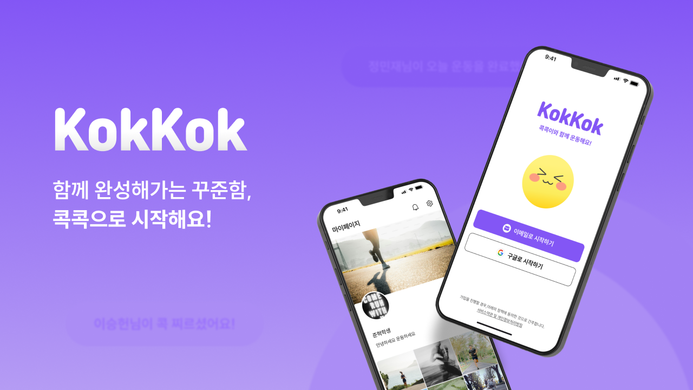
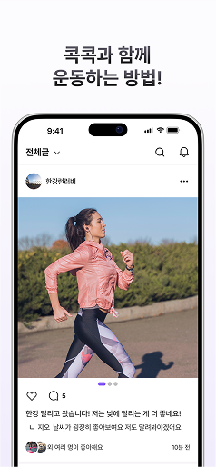
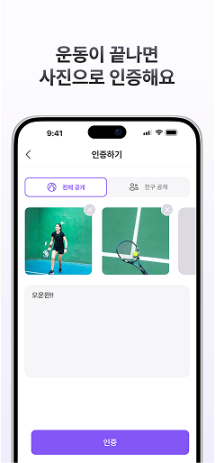
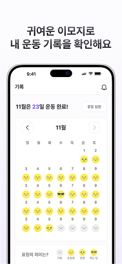
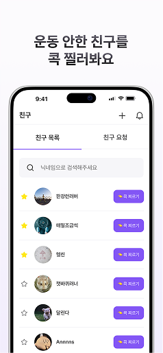

# 콕콕 👉

  
  
  
  
  
  
  
  

 

> 🔗 [안드로이드에서 설치하기](https://play.google.com/store/apps/details?id=com.epilogue.kokkok)  

> 🔗 [iOS에서 설치하기](https://apps.apple.com/kr/app/%EC%BD%95%EC%BD%95/id6739578519)  
 

## 👀 About 콕콕

혼자서는 흐지부지 끝나버리는 운동...  
콕콕은 친구들의 도움을 받아 꾸준히 운동하고 싶다는 바람에서 시작됐습니다.  
가벼운 시도가 꾸준함으로 이어지도록, 사진 인증과 콕 찌르기로 서로를 응원해보세요.  
자극과 응원이 쌓여 습관이 되는 과정을 함께 만들어가요!  
 

### 📱App Preview
      
 
 
 

## ✨ Features  
### ⚙️ Main Features  
📸 **사진 인증 기능**  
하루 한 번 운동 인증 사진을 업로드해 나의 루틴을 기록하고, 친구들과 자극을 주고 받을 수 있어요. 
  
  

📅 **달력 기록**  
한 달간의 운동 현황을 이모지로 시각화하여, 내 꾸준함을 직관적으로 확인할 수 있어요.  
 

🧑‍💻 **마이페이지**  
지금까지 쌓아온 나의 운동 기록을 한눈에 돌아보고, 성취감을 느낄 수 있어요.  
 

### ➕ Additional Features  
💬 **댓글 기능**  
친구의 인증에 댓글로 응원하고, 함께 운동하는 재미를 더할 수 있어요.  
 

👈 **콕 찌르기**  
운동 인증을 안 한 친구를 콕! 찔러서 가볍게 자극을 줄 수 있어요.  
 

⭐️ **친구 즐겨찾기**  
자주 소통하는 친구를 즐겨찾기로 등록하면, 그 친구가 인증할 때마다 알림으로 동기부여를 받을 수 있어요.

 
 
 

